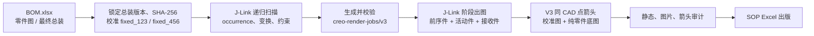

# Creo 装配 SOP 生成流水线

从 `BOM.xlsx` 和 Creo 最终总装出发，生成经过校验的安装步骤图，并将合格图片写入 SOP Excel 模板。

当前仓库面向后续开发者：先保证步骤图正确，再进行 SOP 出版。正式 CAD 自动化只使用 Creo 异步 J-Link Java API；不使用屏幕坐标或 computer use。

## 输入与产物

| 输入 | 用途 |
| --- | --- |
| `BOM.xlsx` | 工序层级、物料、数量、工艺文字、控制要点和工装 |
| `零件图/` | Creo `.asm/.prt` 模型；其中版本最高的最终总装用于正式出图 |
| `SOP示例.xlsx` | 固定发布版式；不参与步骤规划 |

| 产物 | 位置 |
| --- | --- |
| 锁定的总装、哈希和双视角 | `data/runs/*authoritative-assembly*.json`、`*camera-basis*.json` |
| 递归 occurrence 图 | `data/runs/*final-recursive-discovery*.json` |
| 安装步骤任务与相机合同 | `data/runs/*render-jobs*.json`、`data/runs/*camera-contracts/` |
| 安装图片与箭头审计 | `outputs/images/` |
| 可出版 SOP | `outputs/published_sop/` |

## 当前水箱批次流程



步骤含义：

1. 总装只在批次开始时锁定一次；最终总装是正式几何、位置、坐标和相机来源。
2. discovery 将每个零件映射为从根总装开始的完整 occurrence 路径。
3. 每个步骤只显示此前已完成件、本步活动件、接收件和有证据的必要上下文；后续件必须隐藏。
4. 爆炸只允许沿接收面法向纯平移；已完成子装配以后续步骤中的刚性整体处理。
5. 相机只能在产品级 `fixed_123`、`fixed_456` 中选择其一。
6. V3 箭头从活动件同一 CAD 锚点的爆炸态指向完整态；只有通过审计的图片才能出版。

## 从零开始跑一个产品

以下命令在 PowerShell、仓库根目录执行。先把运行时示例复制为本机配置；许可证文件本身不进入仓库。

### 1. 预检

```powershell
Copy-Item ./config/creo-runtime.example.json ./config/creo-runtime.json
# 编辑 ./config/creo-runtime.json，填写 Creo 安装目录、许可证文件及 Java/Python 命令。
$product = './products/water-tank/product.json'

./skills/generate-creo-assembly-sop/scripts/preflight.ps1 `
  -ProjectRoot . `
  -JobContract ./data/runs/corrected-v2-render-jobs.json `
  -ProductConfig $product
```

确认输入 BOM、Creo 模型目录、J-Link 环境和输出目录可用。预检失败时先修复环境，不开始批量出图。

### 2. 锁定最终总装与标准双视角

`$product` 指向一个产品包，包含 BOM、模型目录、SOP 模板和最终总装名。水箱配置位于 `products/water-tank/product.json`；新产品从 `products/product.example.json` 复制并填写。

```powershell
./creo_java/run_camera_calibration.ps1 `
  -ProductConfig $product `
  -OutputJson ./data/runs/jb9918900337-camera-basis-v3.json

python ./scripts/create_authoritative_assembly_manifest.py `
  --models-dir ./零件图 `
  --assembly jb9918900337.asm.2 `
  --camera-basis ./data/runs/jb9918900337-camera-basis-v3.json `
  --output ./data/runs/jb9918900337-authoritative-assembly.json
```

输出：相机基准和权威总装清单。之后若总装哈希变化，已有批次不得继续使用。

### 3. 递归扫描最终总装

```powershell
./creo_java/run_discovery.ps1 `
  -ProductConfig $product `
  -OutputJson ./data/runs/jb9918900337-final-recursive-discovery.json
```

输出：递归 occurrence 图。它用于 BOM 到完整 occurrence 路径的匹配、接收件定位和后续步骤规划。

### 4. 生成并检查步骤任务

当前水箱批次采用已校正的规划脚本：

```powershell
python ./scripts/create_corrected_bom_render_jobs.py
python ./scripts/validate_corrected_bom_render_jobs.py
```

输出：`data/runs/corrected-v2-render-jobs.json` 及对应相机合同。静态校验必须确认数量、前序可见集、接收件、接收面法向爆炸方向、双视角和安装顺序。

### 5. V3 单步骤试跑

先对一个任务生成一张正式箭头图；`JobIndex` 从 `0` 开始。

```powershell
./creo_java/run_pixel_arrow_trial_v3.ps1 `
  -ProductConfig $product `
  -JobsJson ./data/runs/corrected-v2-render-jobs.json `
  -OutputFolder ./outputs/images/v3-trial-01 `
  -JobIndex 0
```

输出目录内会包含：

- `*.base.jpg`：没有箭头的纯零件底图；
- `*.calibration.jpg`：只用于读取原生投影端点，不发布；
- `*.arrow.json`：同点、方向、覆盖 occurrence 的审计；
- `*.jpg`：最终绿色箭头安装图。

如出现总装哈希不符、可见集不符、箭头数量不符或图片不可读，runner 应阻断该图；不要用后续零件补画面，也不要改用第三视角。

### 6. 校验与出版

完整水箱图片在 `outputs/images/jlink/corrected-v3/` 时，运行：

```powershell
python ./scripts/validate_corrected_render_outputs.py

$env:SOP_REFERENCE_PATH = 'D:\path\to\one-process-per-sheet-template.xlsx'
node ./scripts/build_grouped_published_sop.mjs
python ./scripts/validate_published_sop.py
```

输出：`outputs/published_sop/JB9918900337_水箱部件装配SOP_出版版.xlsx`。发布脚本按模板的“一主工序一工作表”结构写入合格图片与 BOM 来源文字。

## 目录导航

| 目录 | 内容 |
| --- | --- |
| `creo_java/` | J-Link Java 源码、构建脚本、Creo runner 和 V3 箭头合成入口 |
| `src/sop_pipeline/` | BOM、CAD 图谱、规划、校验、像素箭头和出版逻辑 |
| `scripts/` | 总装锁定、任务生成、批次和出版校验工具 |
| `data/runs/` | 批次合同、扫描结果、相机基准和临时会话记录 |
| `outputs/` | 安装图片和出版 Excel；不作为源码提交 |
| `docs/` | 正式渲染与箭头规则 |
| `products/` | 可移植的产品包配置；不包含 CAD、运行时路径或许可证 |
| `tests/` | 规划、相机和 V3 箭头的确定性测试 |

## 开发约束

- 正式出图只使用最终总装；中间 ASM 可用于诊断，但不能成为正式图片来源。
- 总装 occurrence 必须使用完整根路径，例如 `51/5025/79`，不能使用裸特征号。
- 源 CAD 保持只读；所有会话在隔离副本中运行且不保存。
- 正式箭头只使用 V3 校准图 + 纯零件底图流程；不使用旧图片覆盖箭头脚本。
- 不使用相对 `X/Y/Z` 旋转、第三视角、动态几何裁切或按颜色隐藏焊接标识。
- `data/runs/`、`outputs/`、Creo 模型和本地构建缓存均为运行产物，不提交到仓库。

后续的大型装配将增加递归 `BuildNode` 与可重建的派生 ASM 缓存：它们用于缩小 BOM 理解与渲染范围，但最终总装仍保持唯一几何来源。

## 规则与实现细节

- [安装图规划规则](docs/render-planning-rules.md)：阶段可见性、固定双视角、爆炸、构图和 BOM/CAD 匹配。
- [Pixel Arrow V3 规则](docs/pixel-arrow-v3-rules.md)：同点锚定、端点识别、像素阈值和发布条件。
- [降本增效路线](docs/reduce-script-roadmap.md)：会话复用和后续开发方向。

旧 runner、相对相机和中间 ASM 出图路径只可用于诊断或迁移对照，不能用于新的正式批次。
