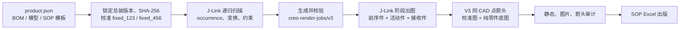

# Creo 装配 SOP 生成流水线

从用户选择的 BOM 和 CAD 文件夹出发，生成经过校验的安装步骤图与可编辑 SOP。

目标产品是 PySide6 Windows 桌面 Agent。正式 CAD 自动化只使用 Creo 异步 J-Link
Java API；语义能力只通过阿里云官方 DashScope SDK 调用 Qwen。界面不直接操作
Creo、Excel 或 Qwen，后台独立进程通过 SQLite 状态和检查点续跑。

## 桌面 Agent

安装依赖后运行：

```powershell
qwen-creo-sop-agent
```

普通用户只需拖入 BOM、选择 CAD 文件夹、查看一次确认页并开始生成。首次使用配置
Creo 安装目录、许可证文件、普通版 Excel 和 DashScope Key；正式包已内置 J-Link
适配代码，不要求用户另找脚本。最终用户目录只保留 `SOP.xlsx`
（有疑问时为 `SOP_待确认.xlsx`）与 `步骤图片/`。

仓库自有的 12 个 Agent Skill 位于 `skills/`，正式接口和状态机实现位于
`src/sop_pipeline/agent/`，桌面入口位于 `src/sop_pipeline/desktop/`。

GUI 不直接调用这些能力。正式调用链为 `GUI → AgentCore → PipelineOrchestrator →
SkillRuntime → Skill Handler → Creo/Qwen/Excel Adapter`。单个Skill可在既有运行批次中
独立调试，仍会接受状态机、Artifact哈希和输出路径约束：

```powershell
qwen-creo-sop-skill `
  --workspace <Agent工作区> `
  --run-id <运行标识> `
  --skill normalize-bom `
  --input-ref analysis/input-manifest.json
```

`pywin32` 是 Windows API/COM 绑定的项目名，不表示只能运行在 32 位系统。安装包使用
64 位 Python 时会安装 64 位扩展，可在 64 位 Windows 上驱动普通版 Excel；构建机、
目标机 Python 和 Excel 的位数仍应保持一致。

发布包必须通过统一入口构建，先编译 J-Link 类再调用 PyInstaller，避免构建目录残留
改变安装包能力。`PythonCommand` 应指向与目标 Excel/系统一致的 64 位 Python：

```powershell
./packaging/build.ps1 `
  -RuntimeConfig ./config/creo-runtime.json `
  -PythonCommand ./data/clean-build/.venv/Scripts/python.exe
```

## 输入与产物

| 输入 | 用途 |
| --- | --- |
| 用户选择的 BOM | 自动识别工作表、表头、工序层级、物料、数量、工艺文字、控制要点和工装 |
| 用户选择的 CAD 文件夹 | 自动锁定最终总装和版本，并从 Creo `.asm/.prt` 提取 occurrence 与约束证据 |

| 产物 | 位置 |
| --- | --- |
| 锁定总装、BOM/CAD 映射、图谱、正式渲染计划、日志和校验报告 | Agent 内部运行目录；不进入用户交付目录 |
| SOP 与步骤图片 | 用户选择的 `交付结果/`；只能包含工作簿和 `步骤图片/` |

真实 Creo 图谱会先编译为 `formal-render-plan/v2`。生成前确认的每个答案与 Qwen 的
受限推荐共同锁定一个版本化 `PlanRevision` 和 `locked-render-plan`；生成阶段只消费该
不可变计划，不再次向 Qwen 询问或重新猜测步骤。Qwen 只推荐“展开子装配”或“整体安装”
这类工艺语义，occurrence、接收几何、平移方向、相机和依赖图仍由确定性代码决定。
相同模型版本与最小语义请求的成功推荐按指纹保存在 Agent 内部，因此确认页仍会显示，
但重复运行相同输入不会因再次调用模型而改变默认方案。

确认后的正式计划继续编译为 `render-plan/v2`。正式 worker 只接受
`arrow_renderer=creo_display_list/v1`：J-Link 在 Creo 模型窗口中使用同一 CAD 表面点
绘制绿色箭头，再由 Creo 导出 JPEG。像素箭头合成器只保留为旧批次诊断和兼容性实验，
不能成为正式任务的静默回退。

## 旧水箱批次诊断流程



步骤含义：

1. 总装只在批次开始时锁定一次；最终总装是正式几何、位置、坐标和相机来源。
2. discovery 将每个零件映射为从根总装开始的完整 occurrence 路径。
3. 每个步骤只显示此前已完成件、本步活动件、接收件和有证据的必要上下文；后续件必须隐藏。
4. 爆炸只允许沿接收面法向纯平移；已完成子装配以后续步骤中的刚性整体处理。
5. 相机只能在产品级 `fixed_123`、`fixed_456` 中选择其一。
6. V3 箭头从活动件同一 CAD 锚点的爆炸态指向完整态；只有通过审计的图片才能出版。

## 旧脚本：从零开始跑一个产品

以下命令在 PowerShell、仓库根目录执行。先把运行时示例复制为本机配置；许可证文件本身不进入仓库。

### 1. 预检

```powershell
Copy-Item ./config/creo-runtime.example.json ./config/creo-runtime.json
# 编辑 ./config/creo-runtime.json，填写 Creo 安装目录、许可证文件及 Java/Python 命令。
$product = './products/water-tank/product.json'

./skills/generate-creo-assembly-sop/scripts/preflight.ps1 `
  -ProjectRoot . `
  -JobContract ./data/runs/corrected-v2-render-jobs.json `
  -ProductConfig $product
```

确认输入 BOM、Creo 模型目录、J-Link 环境和输出目录可用。预检失败时先修复环境，不开始批量出图。

### 2. 锁定最终总装与标准双视角

`$product` 指向一个产品包，包含 BOM、模型目录、SOP 模板和最终总装名。水箱配置位于 `products/water-tank/product.json`；新产品从 `products/product.example.json` 复制并填写。

```powershell
./creo_java/run_camera_calibration.ps1 `
  -ProductConfig $product `
  -OutputJson ./data/runs/jb9918900337-camera-basis-v3.json

python ./scripts/create_authoritative_assembly_manifest.py `
  --product-config $product `
  --camera-basis ./data/runs/jb9918900337-camera-basis-v3.json `
  --output ./data/runs/jb9918900337-authoritative-assembly.json
```

输出：相机基准和权威总装清单。之后若总装哈希变化，已有批次不得继续使用。

### 3. 递归扫描最终总装

Agent 正式路径直接接收 CAD 目录和锁定后的总装相对路径，不需要产品配置：

```powershell
./creo_java/run_input_discovery.ps1 `
  -ModelsDirectory ./零件图 `
  -AssemblyRelativePath jb9918900337.asm.2 `
  -RunWorkspace ./data/runs/discovery-clean `
  -RuntimeConfig ./config/creo-runtime.json
```

该入口输出 `creo-cad-graph/v3`：完整根 occurrence、稳定约束类型、约束两侧模型项，
以及可由 Creo 证明的根坐标曲面法向/轴向。源 CAD 在运行前后逐文件校验哈希。

以下旧产品入口只保留作迁移对照：

```powershell
./creo_java/run_discovery.ps1 `
  -ProductConfig $product `
  -OutputJson ./data/runs/jb9918900337-final-recursive-discovery.json
```

输出：递归 occurrence 图。它用于 BOM 到完整 occurrence 路径的匹配、接收件定位和后续步骤规划。

### 4. 生成并检查步骤任务

当前水箱批次采用已校正的规划脚本：

```powershell
python ./products/water-tank/scripts/create_render_jobs.py
python ./products/water-tank/scripts/validate_render_jobs.py
```

输出：`data/runs/corrected-v2-render-jobs.json` 及对应相机合同。静态校验必须确认数量、前序可见集、接收件、接收面法向爆炸方向、双视角和安装顺序。

### 5. 旧 V3 单步骤诊断试跑

该入口只用于复现旧批次和比较像素合成方案；`JobIndex` 从 `0` 开始。新的正式 Agent
任务不得调用它。

```powershell
./creo_java/run_pixel_arrow_trial_v3.ps1 `
  -ProductConfig $product `
  -JobsJson ./data/runs/corrected-v2-render-jobs.json `
  -OutputFolder ./outputs/images/v3-trial-01 `
  -JobIndex 0
```

输出目录内会包含：

- `*.base.jpg`：没有箭头的纯零件底图；
- `*.calibration.jpg`：只用于读取原生投影端点，不发布；
- `*.arrow.json`：同点、方向、覆盖 occurrence 的审计；
- `*.jpg`：最终绿色箭头安装图。

如出现总装哈希不符、可见集不符、箭头数量不符或图片不可读，runner 应阻断该图；不要用后续零件补画面，也不要改用第三视角。

### 6. 校验与出版

完整水箱图片在 `outputs/images/jlink/corrected-v3/` 时，运行：

```powershell
python ./scripts/validate_corrected_render_outputs.py

$env:SOP_REFERENCE_PATH = 'D:\path\to\one-process-per-sheet-template.xlsx'
python -m sop_pipeline.cli publish <validated-step-contract.json>
python ./products/water-tank/scripts/validate_published_sop.py
```

输出：`outputs/published_sop/JB9918900337_水箱部件装配SOP_出版版.xlsx`。发布脚本按模板的“一主工序一工作表”结构写入合格图片与 BOM 来源文字。

## 目录导航

| 目录 | 内容 |
| --- | --- |
| `creo_java/` | J-Link Java 源码、产品无关 Creo 原生箭头 worker，以及旧 V3 兼容入口 |
| `src/sop_pipeline/` | BOM、CAD 图谱、规划、校验、Agent worker 和出版逻辑 |
| `scripts/` | 与产品无关的总装锁定、图片校验和通用工具 |
| `data/runs/` | 批次合同、扫描结果、相机基准和临时会话记录 |
| `outputs/` | 安装图片和出版 Excel；不作为源码提交 |
| `docs/` | 正式渲染与箭头规则 |
| `products/` | 可移植的产品包配置与产品适配脚本；不包含 CAD、运行时路径或许可证 |
| `tests/` | 规划、相机、Creo 原生箭头合同和旧兼容路径的确定性测试 |

## 开发约束

- 正式出图只使用最终总装；中间 ASM 可用于诊断，但不能成为正式图片来源。
- 总装 occurrence 必须使用完整根路径，例如 `51/5025/79`，不能使用裸特征号。
- 源 CAD 保持只读；所有会话在隔离副本中运行且不保存。
- 正式箭头只使用 Creo/J-Link `DisplayList3D` 原生绘制；像素合成不得静默回退。
- 不使用相对 `X/Y/Z` 旋转、第三视角、动态几何裁切或按颜色隐藏焊接标识。
- `data/runs/`、`outputs/`、Creo 模型和本地构建缓存均为运行产物，不提交到仓库。

后续的大型装配将增加递归 `BuildNode` 与可重建的派生 ASM 缓存：它们用于缩小 BOM 理解与渲染范围，但最终总装仍保持唯一几何来源。

## 规则与实现细节

- [Qwen Agent 产品契约](docs/qwen-agent-product-contract.md)：两项运行输入、无人值守边界、Skill 接口、状态机、交付结构、规模与迁移验收。
- [Qwen Agent 实施计划](docs/qwen-agent-implementation-plan.md)：已确认的桌面产品流程、生成前释疑、步骤隔离、局部再生成、开发阶段和验收标准。
- [安装图规划规则](docs/render-planning-rules.md)：阶段可见性、固定双视角、爆炸、构图和 BOM/CAD 匹配。
- [箭头生成与迁移规则](docs/arrow-generation-and-portability.md)：Creo 原生同点箭头合同、审计与兼容边界。
- [Pixel Arrow V3 兼容规则](docs/pixel-arrow-v3-rules.md)：旧批次诊断与对照，不是正式 Agent 出版入口。
- [Spreadsheet SOP 出版](docs/spreadsheet-sop-publication.md)：模板、图片和出版校验。
- [降本增效路线](docs/reduce-script-roadmap.md)：会话复用和后续开发方向。

旧 runner、相对相机和中间 ASM 出图路径只可用于诊断或迁移对照，不能用于新的正式批次。
